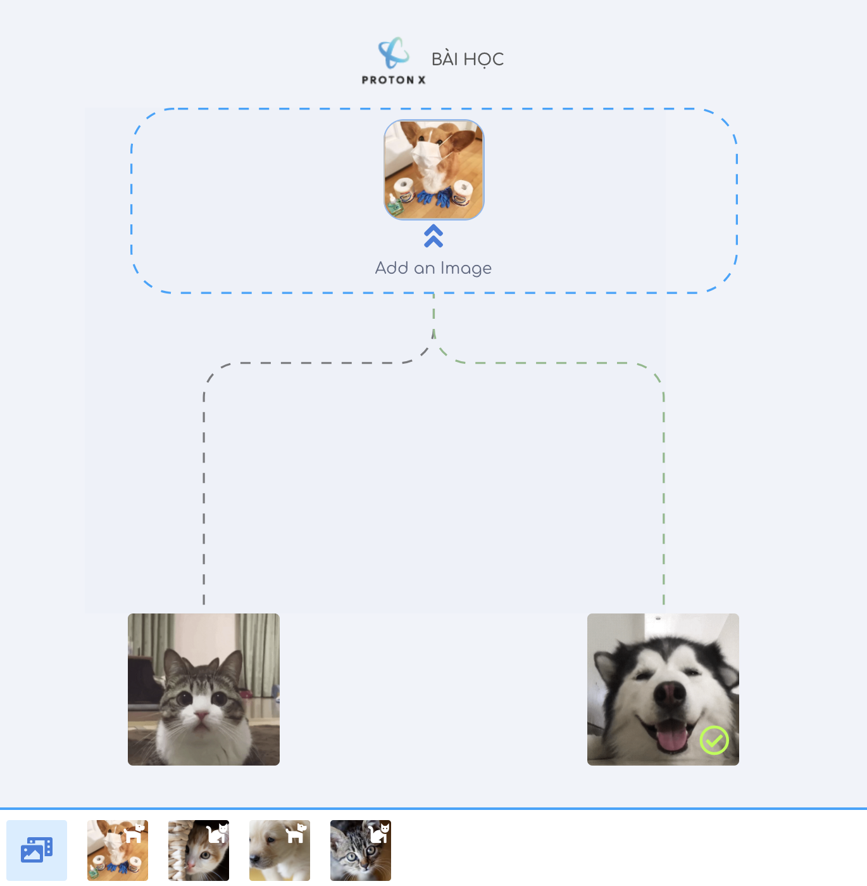

## Lộ trình học Machine Learning, Deep Learning cho người mới bắt đầu

### Mục lục
----
- <a href="./math">1. Kiến thức toán học cần thiết</a> (Hoàn tất)
- <a href="./python-tutorials">2. Kỹ năng lập trình Python</a> (Hoàn tất)
- <a href="./numpy">3. Thư viện Numpy và TensorFlow</a> (Hoàn tất)
- <a href="./visualize">4. Hiển thị dữ liệu và các công cụ</a> (Đang tiến hành)
    - [Dữ liệu bảng](./visualize/pandas)
- <a href="./models/linear-regression/">5. Bài toán hồi quy (Regression)</a> (Hoàn tất)
- <a href="./models/logistic-regression">6. Bài toán phân loại (Classification)</a> (Hoàn tất)
- <a href="./deployment/distributed-tensorflow">7. Triển khai (Deploy) Machine Learning Model trên Production</a> (Hoàn tất)
- <a href="./deployment/tensorflow-browser">8. Machine Learning trên trình duyệt và TensorFlowJS</a> (Hoàn tất)
- <a href="./tf2.0">9. Cập nhật mới nhất</a>
    - [TensorFlow 2.0](https://github.com/bangoc123/learn-machine-learning-in-two-months/tree/master/tf2.0)
    - [Trải nghiệm PaperSpace Gradient Community](https://github.com/bangoc123/learn-machine-learning-in-two-months/tree/master/articles/GradientPaperSpace.MD)
- <a href="./algorithms">10. Ôn luyện thuật toán mỗi ngày</a> (Đang tiến hành)
    - [Backtracking Algorithm](./algorithms/graph/backtracking/backtracking.MD)
- <a href="./algorithms">11. Một số ứng dụng triển khai thực tế</a> (Đang tiến hành)
    - [Ứng dụng Transfer Learning](https://protonx.app/transfer-learning)

      

<a>  12. [Video] AI cơ bản + Luyện thi chứng chỉ Tensorflow </a>
* 1. Giới thiệu Machine Learning/ Deep Learning
    + [Video](https://youtu.be/j5HxIJoOJms)
* 2. Xây dựng bài toán nhận diện giao thông (bao gồm tăng cường data)
    - [Video:  Xử lý dữ liệu và xây dựng model ](https://www.youtube.com/watch?v=EGkRT-kg6zY)
    - [Video: Huấn luyện và tiến hành dự đoán](https://youtu.be/98dZscH8b-0)
    - [Notebook](https://colab.research.google.com/drive/1rYfyDAYP-jvkCLfMotmCQarQahLNJkTa)
* 3. Xây dựng lớp tích chập / MaxPooling
    + [Video](https://www.youtube.com/watch?v=UpABcXXImJ4)
    + [Notebook](https://colab.research.google.com/drive/13FoUwnbXAc01LY35O7D88dpjib73D2R2?usp=sharing)
* 4. Tự động đánh nhãn và xử lý ảnh nhiều chiều
    + [Video](https://youtu.be/ee9tF9xEf04)
    + [Notebook](https://colab.research.google.com/drive/1PCABQRqads5AcJJQcKb_FeVJhAZ61H5V?usp=sharing)
* 5. Transfer Learning với InceptionNet
    + [Video](https://youtu.be/Y-4KLFt_c6Y)
    + [Notebook](https://colab.research.google.com/drive/1M1VlOh4wOQ6od5gvDfVeVQlAdjUgvOfU?usp=sharing)
* 6. Tokenizations and Sequence
    + [Video](https://youtu.be/FT1ZZdcur5A)
    + [Notebook](https://colab.research.google.com/drive/1cVoH2W3TCoNshM-QI9Sbgyzlcpfqq4BR?usp=sharing)
* 7. Word2Vec 
    + [Video](https://youtu.be/akRbuXokLSo)
* 8. Thực hành xây dựng Embeddings
    + [Video](https://youtu.be/JIafLwlGzBA)
    + [Notebook](https://colab.research.google.com/drive/1jhXYAkNjiFRmFc4_E-s8aAkXPNN-QaA2?usp=sharing)
* 9. Mạng RNN 
    + [Video](https://youtu.be/t0EoeTYU-fc)
* 10. Thực hành xây dựng mạng RNN, LSTM, Bi-directional
    + [Video](https://youtu.be/X6bYTZJkEDQ)
    + [Notebook](https://colab.research.google.com/drive/1vBHZsuGlMPlF7VGqACcmFjVDHjSZl0Qj?usp=sharing)
* 11. Tính toán số lượng tham số mạng RNN
    + [Video](https://youtu.be/Ifnxru7brak)
* 12. Bài toán sinh từ
    + [Video](https://youtu.be/-gyb1dpeGCA)
    + [Notebook](https://colab.research.google.com/drive/1uPcO54klRFNkk9o-3Ua6F8ZKQgpzCz1Y?usp=sharing)
* 13. Giới thiệu dữ liệu Time series
    + [Video](https://youtu.be/IbFqMxVuFLM)
* 14. Xây dựng Time Series dataset bằng Tensorflow Dataset
    + [Video](https://youtu.be/TwyNFGTUoY4)
    + [Notebook](https://colab.research.google.com/drive/19b5dUBUrvKCWC1ckrHKB1uvEYpgU2DUB?usp=sharing)
* 15. Sử dụng RNN để giải bài toán dữ liệu thời gian
    + [Video](https://youtu.be/zCxMLNzPa1M)
    + [Notebook](https://colab.research.google.com/drive/1B0fQJfqutwlbFElEGKtd7oH9QXL2X7ly?usp=sharing)
